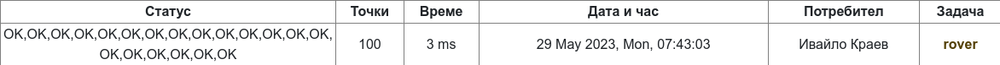

# Data about the task

## Task link:
Here is a [link to the task](https://arena.olimpiici.com/api/public/problems/693/pdf)

## Result from judge

## Required knowledge

#### Algorithms
- [Basic Euclidean algorithm](https://www.geeksforgeeks.org/euclidean-algorithms-basic-and-extended)
- [Algorithm fot the least common multiple](https://www.geeksforgeeks.org/program-to-find-lcm-of-two-numbers)

## Credit

| Role   | Name         |
|--------|--------------|
| Author | Ivaylo Kraev |